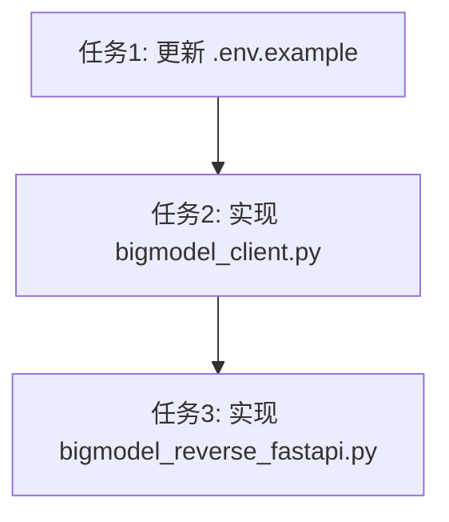

# 智谱AI (BigModel) 反向代理实现计划

> **计划版本**: 1.0  
> **创建日期**: 2026-01-30  
> **基于**: BIGMODEL_DEVELOPMENT_PLAN.md 和 qwen_reverse_fastapi.py 参考架构

---

## 快速摘要

**目标**: 实现基于浏览器Cookies的智谱AI反向代理服务  
**核心特点**: 配置驱动，使用者自行提供Cookies和API端点  
**预计工时**: 简单任务（1-2小时开发时间）  
**执行策略**: 顺序执行（任务间存在依赖关系）

---

## 一、依赖分析和执行顺序

### 1.1 外部依赖（Python包）

| 包名 | 版本要求 | 用途 | 状态 |
|------|----------|------|------|
| fastapi | >= 0.116.1 | Web框架 | 现有 |
| uvicorn[standard] | >= 0.35.0 | ASGI服务器 | 现有 |
| requests | >= 2.32.4 | HTTP客户端 | 现有 |
| python-dotenv | >= 1.1.1 | 配置管理 | 现有 |
| pydantic | >= 2.8.2 | 数据验证 | 现有 |
| python-multipart | >= 0.0.6 | 文件上传支持 | 现有 |

### 1.2 内部依赖关系

```
.env.example（配置模板）
    ↓ 提供环境变量名称和默认值
bigmodel_client.py（客户端封装）
    ↓ 被主程序导入和使用
bigmodel_reverse_fastapi.py（FastAPI主程序）
```

### 1.3 执行顺序（必须串行）

| 顺序 | 任务名称 | 依赖项 | 原因 |
|------|----------|--------|------|
| 1 | 更新 .env.example | 无 | 为后续代码提供配置规范和默认值 |
| 2 | 实现 bigmodel_client.py | .env.example | 使用配置模板中定义的环境变量名称 |
| 3 | 实现 bigmodel_reverse_fastapi.py | bigmodel_client.py | 主程序依赖客户端类进行API调用 |

---

## 二、并行任务分析

### 2.1 并行可行性结论

**结论**: 所有任务必须**串行执行**，无法并行

**原因**:
1. .env.example 必须在开发初期完成（为代码提供配置规范）
2. bigmodel_client.py 必须在 bigmodel_reverse_fastapi.py 之前完成（主程序依赖客户端类）

### 2.2 任务依赖图



### 2.3 单任务内部并行化

每个任务内部可以通过以下方式提高效率：

**任务2（bigmodel_client.py）内部可并行**:
- CookieManager 类实现
- BigModelClient 类实现
- OpenAI 格式转换方法

但由于代码量较小，顺序实现更易于维护代码一致性。

---

## 三、详细任务分配和技能要求

### 任务1：更新 .env.example

**推荐 Agent Profile**:
- **Category**: quick（简单配置文件修改）
- **Skills**: 无特殊技能要求
- **Skills Evaluated but Omitted**: 无

**理由**: 此任务仅为配置文件更新，不涉及复杂逻辑，使用 quick 类别即可高效完成。

### 任务2：实现 bigmodel_client.py

**推荐 Agent Profile**:
- **Category**: ultrabrain（复杂逻辑实现）
- **Skills**: 无特殊技能要求
- **Skills Evaluated but Omitted**: 无

**理由**:
- 需要实现Cookie解析、API调用、响应转换等多个功能模块
- 需要参考千问项目的架构模式
- 涉及流式/非流式响应处理逻辑

### 任务3：实现 bigmodel_reverse_fastapi.py

**推荐 Agent Profile**:
- **Category**: ultrabrain（复杂Web服务开发）
- **Skills**: 无特殊技能要求
- **Skills Evaluated but Omitted**: 无

**理由**:
- FastAPI应用开发涉及多个API端点
- 需要处理认证、中间件、错误处理等
- 需要与bigmodel_client.py协同工作

---

## 四、详细TODO列表

### 任务1：更新 .env.example

- [ ] 1.1 添加 BigModel 必需配置项说明
  - BIGMODEL_COOKIES（必填）
  - BIGMODEL_BASE_URL（默认: https://bigmodel.cn）
  - BIGMODEL_CHAT_ENDPOINT（默认: /api/chat/completions）
  - BIGMODEL_MODELS_ENDPOINT（默认: /api/models）
- [ ] 1.2 添加 BigModel 可选配置项说明
  - BIGMODEL_USER_ENDPOINT（默认: /api/user/info）
- [ ] 1.3 保留现有的 API 鉴权配置部分
  - VALID_TOKENS 配置说明
  - JSON 数组格式和逗号分隔格式示例
- [ ] 1.4 添加 BigModel 获取指南
  - 如何从浏览器获取 Cookies
  - 如何确定 API 端点
- [ ] 1.5 清理千问相关配置注释（保留结构作为参考）

**验收标准**:
- [ ] 所有 BigModel 必需配置项都有明确说明
- [ ] 提供清晰的获取 Cookies 步骤
- [ ] 配置示例格式正确，可直接复制使用
- [ ] 与现有 .env.example 风格保持一致

### 任务2：实现 bigmodel_client.py

#### CookieManager 类

- [ ] 2.1 创建 CookieManager 类结构
  - `__init__` 初始化方法
  - `_parse_cookies` 私有解析方法
  - `get_cookie_string` 获取原始Cookie字符串
  - `get` 获取指定Cookie值
  - `get_all` 获取所有Cookies
  - `validate` 验证Cookie完整性

**验收标准**:
- [ ] Cookie字符串解析正确（支持 "key1=value1; key2=value2" 格式）
- [ ] `get` 方法支持默认值参数
- [ ] `validate` 方法返回结构包含 has_cookies、cookie_count、keys

#### BigModelClient 类

- [ ] 2.2 创建 BigModelClient 类初始化方法
  - 接收 cookies、base_url、chat_endpoint、models_endpoint、user_endpoint 参数
  - 初始化 requests.Session
  - 初始化 CookieManager
  - 设置请求头（模拟真实浏览器环境）

- [ ] 2.3 实现 `_init_headers` 方法
  - 设置 accept、accept-language、content-type
  - 设置 User-Agent（参考千问项目）
  - 设置 origin 和 referer

- [ ] 2.4 实现 `list_models` 方法
  - 构建模型列表API URL
  - 发送GET请求
  - 返回JSON响应或抛出HTTPException

- [ ] 2.5 实现 `chat_completions` 方法
  - 解析OpenAI格式请求（model、messages、stream）
  - 构建BigModel请求体
  - 支持可选参数（temperature、top_p、max_tokens）
  - 根据 stream 参数选择流式或非流式响应

- [ ] 2.6 实现 `_streaming_response` 方法
  - 发送流式POST请求
  - 解析SSE响应（data: 前缀）
  - 处理 [DONE] 结束信号
  - 调用 `_convert_to_openai_chunk` 转换响应格式
  - 返回生成器

- [ ] 2.7 实现 `_non_streaming_response` 方法
  - 发送流式请求但聚合响应
  - 提取完整响应文本
  - 收集 usage 数据
  - 返回OpenAI格式的JSON响应

- [ ] 2.8 实现 `_convert_to_openai_chunk` 方法
  - 将BigModel响应转换为OpenAI格式
  - 包含 id、object、created、model、choices
  - 处理 delta 和 finish_reason

- [ ] 2.9 实现 `_extract_content` 方法
  - 从BigModel响应中提取内容
  - 支持累积文本构建

**验收标准**:
- [ ] CookieManager 正确解析和验证Cookies
- [ ] BigModelClient 正确初始化和设置请求头
- [ ] list_models 方法返回有效的模型列表
- [ ] chat_completions 支持流式和非流式响应
- [ ] 流式响应正确生成SSE格式数据
- [ ] 非流式响应正确构建OpenAI格式JSON
- [ ] 所有API请求都携带正确的Cookies

### 任务3：实现 bigmodel_reverse_fastapi.py

#### 配置和初始化

- [ ] 3.1 导入必要的依赖模块
  - FastAPI 相关（FastAPI、HTTPException、Depends、Header）
  - 响应相关（StreamingResponse、JSONResponse）
  - 中间件（CORSMiddleware）
  - 其他（requests、time、json、os、logging、sys）
  - dotenv 和 typing

- [ ] 3.2 加载环境变量
  - 使用 load_dotenv() 加载 .env 文件

- [ ] 3.3 配置日志系统
  - 创建 logs 目录（如果不存在）
  - 配置日志格式和处理器
  - 创建 bigmodel_fastapi 日志记录器

- [ ] 3.4 读取 BigModel 配置
  - BIGMODEL_COOKIES
  - BIGMODEL_BASE_URL
  - BIGMODEL_CHAT_ENDPOINT
  - BIGMODEL_MODELS_ENDPOINT
  - BIGMODEL_USER_ENDPOINT

- [ ] 3.5 配置 API 鉴权
  - VALID_TOKENS 解析（支持JSON和逗号分隔格式）
  - PORT 读取
  - DEBUG_STATUS 读取

- [ ] 3.6 初始化 BigModelClient
  - 导入 bigmodel_client 模块
  - 创建 BigModelClient 实例
  - 记录初始化状态到日志

**验收标准**:
- [ ] 所有必要的依赖模块正确导入
- [ ] 环境变量正确加载
- [ ] 日志系统正常工作
- [ ] BigModelClient 初始化成功（记录 info 级别日志）

#### FastAPI 应用

- [ ] 3.7 创建 FastAPI 应用实例
  - 设置 title、description、version

- [ ] 3.8 配置 CORS 中间件
  - 允许所有来源（开发模式）
  - 允许凭证和所有方法/头

- [ ] 3.9 实现 `verify_auth_token` 依赖函数
  - 验证 Authorization Header
  - 解析 Bearer Token
  - 验证 Token 是否在 VALID_TOKENS 列表中
  - 无配置时跳过鉴权

- [ ] 3.10 实现 `/` 根端点
  - 返回服务器信息（name、version、description、docs）

- [ ] 3.11 实现 `/health` 健康检查端点
  - 返回 status 和 timestamp

- [ ] 3.12 实现 `/v1/models` 端点
  - 调用 bigmodel_client.list_models()
  - 验证客户端已初始化
  - 返回模型列表或抛出异常

- [ ] 3.13 实现 `/v1/chat/completions` 端点
  - 接收 OpenAI 格式的请求体
  - 验证 Authorization Token
  - 验证 BIGMODEL_COOKIES 已配置
  - 调用 bigmodel_client.chat_completions()
  - 支持流式响应（StreamingResponse）
  - 支持非流式响应（JSONResponse）
  - 错误处理和日志记录

- [ ] 3.14 添加主程序入口
  - 使用 uvicorn.run() 启动服务
  - 读取 PORT 环境变量
  - 设置 host 为 0.0.0.0

**验收标准**:
- [ ] FastAPI 应用正确创建和配置
- [ ] CORS 中间件正常工作
- [ ] Token 鉴权功能正确（配置时生效，无配置时跳过）
- [ ] 所有 API 端点返回正确的响应格式
- [ ] 流式响应正确返回 SSE 格式
- [ ] 错误情况返回正确的 HTTP 状态码和错误信息
- [ ] 服务可以正常启动并监听指定端口

---

## 五、验证标准

### 5.1 代码质量验证

**通用标准**:
- [ ] 代码符合 Python PEP 8 编码规范
- [ ] 关键逻辑有中文注释
- [ ] 无未使用的导入语句
- [ ] 变量和函数命名清晰、语义化
- [ ] 错误处理包含适当的异常捕获和日志记录

### 5.2 功能验证

**CookieManager 验证**:
- [ ] 解析 "key1=value1; key2=value2" 格式正确
- [ ] get 方法支持默认值
- [ ] get_all 返回正确的字典副本
- [ ] validate 返回包含 has_cookies、cookie_count、keys 的字典

**BigModelClient 验证**:
- [ ] 初始化时正确设置请求头
- [ ] Cookie 随每个请求发送
- [ ] list_models 返回有效的 JSON 响应
- [ ] 流式响应生成器正确产出数据块
- [ ] 非流式响应聚合完整内容
- [ ] OpenAI 格式转换正确

**FastAPI 应用验证**:
- [ ] 服务启动无错误
- [ ] GET / 返回服务器信息
- [ ] GET /health 返回健康状态
- [ ] GET /v1/models 返回模型列表（需要有效Cookies）
- [ ] POST /v1/chat/completions 返回正确的聊天响应（需要有效Cookies和Token）
- [ ] 流式请求正确返回 SSE 流
- [ ] 鉴权失败返回 401/403 状态码
- [ ] 未配置 Cookies 时返回 401 错误提示

### 5.3 配置验证

**.env.example 验证**:
- [ ] 所有必需配置项都有说明
- [ ] 提供清晰的使用步骤
- [ ] 配置示例可直接复制使用
- [ ] 格式与现有项目风格一致

### 5.4 手动集成测试

**测试场景**:
1. **启动测试**: python bigmodel_reverse_fastapi.py 正常启动
2. **健康检查**: curl http://localhost:8000/health 返回 {"status": "healthy"}
3. **模型列表**: curl http://localhost:8000/v1/models 返回有效模型列表
4. **非流式聊天**: curl POST 请求返回 JSON 响应
5. **流式聊天**: curl POST 请求返回 SSE 流
6. **鉴权测试**: 未提供 Token 时返回 403 错误

---

## 六、代码结构参考

### 6.1 bigmodel_client.py 结构

```python
# bigmodel_client.py

import requests
import json
import time
from typing import Dict, Any, Generator, Union

class CookieManager:
    """Cookie管理器 - 解析和验证使用者配置的Cookies"""
    def __init__(self, cookie_string: str = ""): ...
    def _parse_cookies(self, cookie_string: str) -> Dict[str, str]: ...
    def get_cookie_string(self) -> str: ...
    def get(self, key: str, default: str = "") -> str: ...
    def get_all(self) -> Dict[str, str]: ...
    def validate(self) -> Dict[str, Any]: ...

class BigModelClient:
    """用于与 bigmodel.cn Web界面 API 交互的客户端"""
    def __init__(self, cookies: str = "", base_url: str = "https://bigmodel.cn", ...): ...
    def _init_headers(self): ...
    def list_models(self) -> Dict[str, Any]: ...
    async def chat_completions(self, openai_request: dict) -> Union[Dict, Generator]: ...
    def _streaming_response(self, request: dict, original_model: str) -> Generator: ...
    def _non_streaming_response(self, request: dict, original_model: str) -> Dict: ...
    def _convert_to_openai_chunk(self, data: dict, original_model: str) -> Dict: ...
    def _extract_content(self, data: dict, current_text: str) -> str: ...
```

### 6.2 bigmodel_reverse_fastapi.py 结构

```python
# bigmodel_reverse_fastapi.py

from fastapi import FastAPI, HTTPException, Depends, Header
from fastapi.responses import StreamingResponse, JSONResponse
from fastapi.middleware.cors import CORSMiddleware
import requests
import time
import json
import os
import logging
import sys
from dotenv import load_dotenv
from typing import Dict, Any, Generator, Union

# 配置加载
load_dotenv()

# 日志配置
def setup_logging(): ...

logger = setup_logging()

# 环境变量读取
BIGMODEL_COOKIES = os.environ.get("BIGMODEL_COOKIES", "")
BIGMODEL_BASE_URL = os.environ.get("BIGMODEL_BASE_URL", "https://bigmodel.cn")
# ... 其他配置

# 客户端初始化
from bigmodel_client import BigModelClient
bigmodel_client = BigModelClient(...)

# FastAPI 应用
app = FastAPI(title="BigModel Reverse API", ...)

# CORS 配置
app.add_middleware(CORSMiddleware, ...)

# 鉴权依赖
def verify_auth_token(authorization: str = Header(None)): ...

# API 端点
@app.get("/")
async def root(): ...

@app.get("/health")
async def health(): ...

@app.get("/v1/models")
async def list_models(): ...

@app.post("/v1/chat/completions")
async def chat_completions(request: dict, token: str = Depends(verify_auth_token)): ...

# 启动入口
if __name__ == "__main__":
    import uvicorn
    uvicorn.run(app, host="0.0.0.0", port=PORT)
```

---

## 七、参考架构要点

### 7.1 参考千问项目的实现模式

**CookieManager 参考**:
- 简化版本，不包含复杂的健康检查机制
- 基础解析、验证功能
- ESSENTIAL_PARAMS 可选（暂不实现）

**QwenClient 参考**:
- Session 管理模式
- 请求头初始化（模拟浏览器环境）
- 流式/非流式响应处理
- OpenAI 格式转换逻辑

**FastAPI 应用参考**:
- 配置加载方式
- 日志配置模式
- 鉴权依赖函数实现
- CORS 中间件配置

### 7.2 差异化实现（简化）

| 功能 | 千问项目 | BigModel项目 |
|------|----------|--------------|
| Cookie健康检查 | 复杂实现 | 基础验证 |
| 会话历史 | SQLite存储 | 不实现 |
| 多模态支持 | 完整实现 | 不实现 |
| 文件上传 | OSS集成 | 不实现 |
| 高级参数 | 全面支持 | 仅基础参数 |

---

## 八、风险和注意事项

### 8.1 潜在风险

1. **BigModel API 变更**: 如果 bigmodel.cn 的 API 端点或响应格式变更，可能需要调整代码
2. **Cookie 过期**: 使用者需要定期更新 Cookies（参考千问项目的健康检查机制可后续添加）
3. **响应格式差异**: BigModel 实际响应可能与预期不同，需要测试调整

### 8.2 注意事项

1. **配置驱动设计**: 确保所有可配置项都通过环境变量设置
2. **错误提示友好**: 未配置 Cookies 时给出清晰的错误提示
3. **日志记录**: 关键操作记录日志，便于问题排查
4. **向后兼容**: 保持与 OpenAI API 的基本兼容

---

## 九、执行建议

### 9.1 开发顺序

1. **第一阶段**: 更新 .env.example（30分钟）
2. **第二阶段**: 实现 bigmodel_client.py（1小时）
3. **第三阶段**: 实现 bigmodel_reverse_fastapi.py（1小时）

### 9.2 测试建议

1. **逐步验证**: 每个子任务完成后进行本地测试
2. **模拟测试**: 使用模拟的 Cookie 和响应进行功能测试
3. **集成测试**: 完整功能测试需要实际的 BigModel Cookies

---

**计划完成时间**: 2-3小时实际开发时间  
**下一个动作**: 运行 /start-work 开始执行计划
